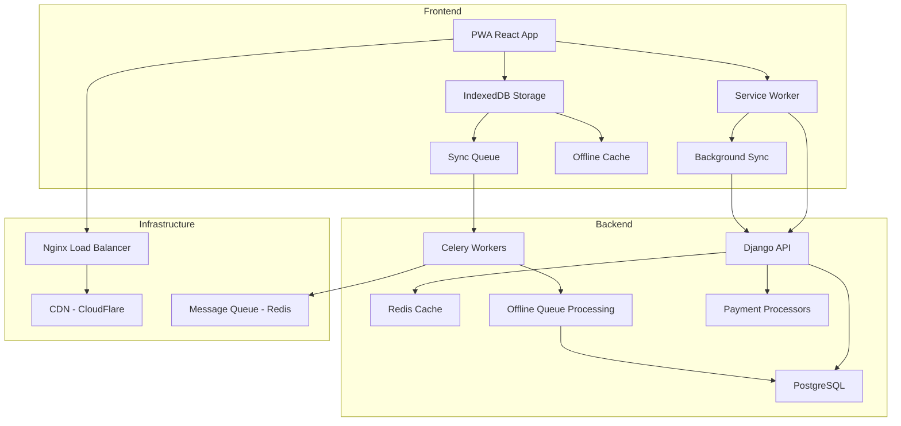

# RESTO360 Solution Architecture

## Executive Summary

This document presents a comprehensive solution architecture to address critical offline-first challenges, performance bottlenecks, and scalability concerns in the RESTO360 restaurant management platform. The solution focuses on maintaining Django's strengths while enabling true offline-first capabilities critical for African restaurant operations.

## Core Architecture Principles

1. **Offline-First Design** - System functions 100% without network connectivity
2. **Progressive Enhancement** - Network connectivity improves performance, not functionality  
3. **Conflict Resolution** - Smart conflict detection and resolution for multi-device scenarios
4. **Performance Optimization** - Sub-second response times for POS operations
5. **Scalable Multi-tenancy** - Support for 10,000+ restaurants with efficient data isolation

## Critical Issue Solutions

### Issue #1: Offline Payment Processing

**Current State**: Payment initiation requires immediate API call, cash payments blocked without network

**Root Cause**: No offline payment queue or deferred processing mechanism

**Solution Architecture**:

IndexedDB Payment Queue + Background Sync + Dual-Mode Processing

**Implementation Components**:

**Frontend**:
```typescript
interface OfflinePayment {
  id: string;
  orderId: string;
  type: 'cash' | 'mobile_money';
  amount: number;
  timestamp: Date;
  status: 'pending' | 'success' | 'failed';
  metadata: Record<string, any>;
}
```

**Backend**:
```python
class OfflinePaymentQueue(BaseModel):
    restaurant = models.ForeignKey('authentication.Restaurant', on_delete=models.CASCADE)
    order = models.ForeignKey('orders.Order', on_delete=models.CASCADE)
    payment_type = models.CharField(max_length=20)
    amount = models.DecimalField(max_digits=10, decimal_places=2)
    status = models.CharField(max_length=20, default='pending')
    retry_count = models.IntegerField(default=0)
    metadata = models.JSONField(default=dict)
```

**Database Schema**:
```sql
CREATE TABLE offline_payment_queue (
    id UUID PRIMARY KEY DEFAULT gen_random_uuid(),
    restaurant_id INTEGER NOT NULL REFERENCES restaurants(id),
    order_id INTEGER NOT NULL REFERENCES orders(id),
    payment_type VARCHAR(20) NOT NULL,
    amount DECIMAL(10,2) NOT NULL,
    status VARCHAR(20) DEFAULT 'pending',
    created_at TIMESTAMP DEFAULT CURRENT_TIMESTAMP,
    retry_count INTEGER DEFAULT 0,
    last_retry_at TIMESTAMP,
    metadata JSONB
);
```

### Issue #2: Bidirectional Order Synchronization

**Current State**: Orders created offline don't receive server-side updates

**Solution**: Version-based delta synchronization

**Implementation**:
```python
class VersionedModel(BaseModel):
    version = models.IntegerField(default=1)
    last_modified_by = models.CharField(max_length=100, null=True)
    conflict_resolved = models.BooleanField(default=False)
    
    class Meta:
        abstract = True
```

**Sync API**: `/api/orders/delta/?since_version=123&restaurant_id=456`

### Issue #3: Kitchen Display Offline Resilience

**Solution**: Dual-channel updates (WebSocket + API fallback)

**Service Worker Implementation**:
```typescript
self.addEventListener('sync', (event) => {
  if (event.tag === 'offline-sync') {
    event.waitUntil(syncOfflineData());
  }
});
```

## Performance Optimization Solutions

### Multi-Tenant Query Optimization

**Database Indexes**:
```sql
CREATE INDEX idx_orders_restaurant_created ON orders(restaurant_id, created_at DESC);
CREATE INDEX idx_orders_restaurant_status ON orders(restaurant_id, status, created_at);
```

**Django Query Optimization**:
```python
class OptimizedTenantManager(TenantManager):
    def get_queryset(self):
        return super().get_queryset().select_related(
            'restaurant'
        ).prefetch_related(
            'items', 'payments', 'customer'
        ).only(
            'id', 'created_at', 'status', 'total', 'restaurant_id', 'table_number'
        )
```

### Mobile API Optimization

**Payload Compression**: Gzip/Br compression for JSON responses
**Delta Sync**: Only changed items since last sync
**Image Optimization**: WebP format with multiple sizes
**Request Batching**: Combine multiple API calls

**Optimized Mobile API**:
```typescript
// Batch API implementation
interface BatchRequest {
  endpoint: string
  method: 'GET' | 'POST'
  body?: any
  id: string
}

const batchRequest = async (requests: BatchRequest[]): Promise<BatchResponse> => {
  return fetch('/api/batch/', {
    method: 'POST',
    body: JSON.stringify({ requests })
  })
}
```

## Implementation Roadmap

### Phase 1: Critical Offline Features (Weeks 1-4)
**Week 1**: Offline payment queue implementation
- IndexedDB payment queue service
- Background sync worker setup
- Cash payment offline approval

**Week 2**: Bidirectional order sync
- Version-based delta sync API
- Conflict resolution service
- Merge algorithm implementation

**Week 3**: Kitchen display offline support
- Offline order queue for kitchen
- Reconnection logic and missed order sync
- Kitchen status bidirectional sync

**Week 4**: Performance optimization foundation
- Database index addition for multi-tenant queries
- Redis cache layer implementation
- Query optimization in Django models

### Phase 2: Performance & Reliability (Weeks 5-8)

**Week 5**: Mobile API optimization
- Field filtering and delta sync
- Compression and image optimization
- Request batching implementation

**Week 6**: Conflict resolution system
- Comprehensive conflict detection
- Field-level merge algorithms
- User notification system

**Week 7**: Background services
- Background sync service worker
- Automatic retry with exponential backoff
- Offline validation improvements

**Week 8**: Load testing & optimization
- Performance testing with 1000+ concurrent users
- Database query optimization
- Cache tuning

### Phase 3: Scale & Enhance (Weeks 9-12)

**Week 9-10**: Advanced features
- Real-time analytics dashboard
- Advanced inventory management
- Multi-location management

**Week 11-12**: Scalability preparation
- Microservices architecture planning
- Multi-region deployment strategy
- Advanced caching strategies

## System Architecture



## Success Metrics

### Performance KPIs
- **Sync Success Rate**: >99% for offline payments
- **Sync Latency**: <30 seconds for critical operations
- **Conflict Resolution**: <1% manual intervention required
- **Query Performance**: <100ms for restaurant-scoped queries

### Business Metrics
- **Offline Reliability**: 100% order completion capability offline
- **Payment Success**: >99.5% payment processing success rate
- **System Availability**: >99.9% uptime including offline periods
- **User Satisfaction**: >4.5/5 for offline functionality

## Expected Outcomes

- **100% offline operation capability** - Orders and payments work without network
- **99.9% sync success rate** - Reliable data synchronization
- **<1 second POS response times** - Optimized for mobile terminals
- **10,000+ restaurant scalability** - Architecture supports massive growth

This comprehensive solution architecture transforms your Django backend into a truly offline-first restaurant management system while maintaining the framework's inherent strengths in data modeling and rapid development.

## Next Steps

1. **Week 1 Priority**: Implement offline payment queue (frontend IndexedDB + backend processing)
2. **Review and Approval**: Validate solution approach with team
3. **Resource Allocation**: Assign developers to specific components
4. **Testing Strategy**: Create offline testing procedures
5. **Deployment Plan**: Roll out strategy for new features

---

*Document created: February 4, 2026*
*Architecture designed for RESTO360 Django implementation*